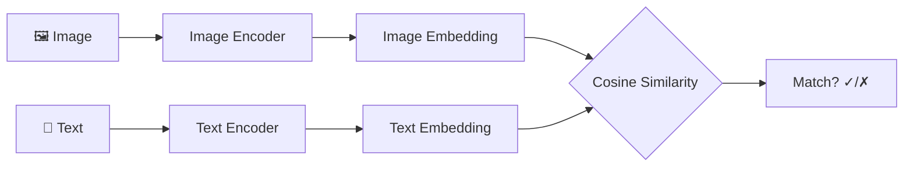
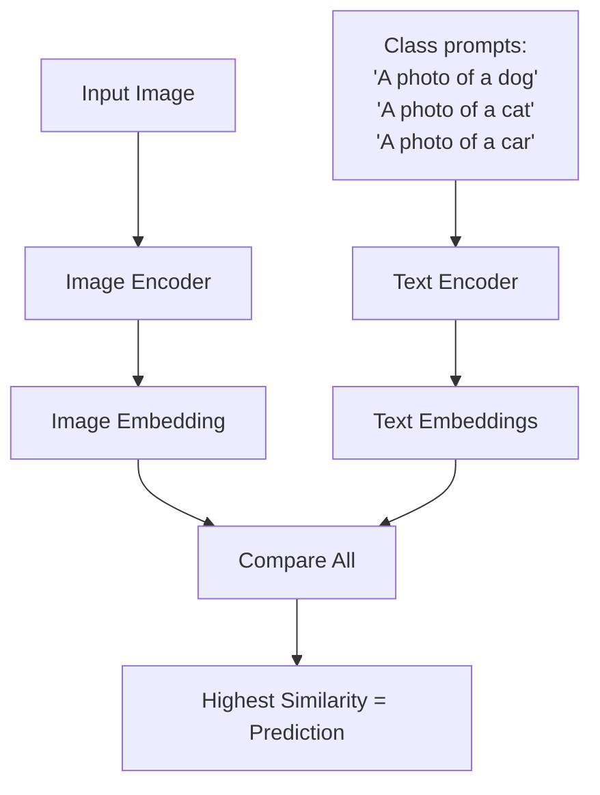

# CLIP: Contrastive Language-Image Pre-training

> Learning visual concepts from natural language supervision

## 🎯 One-Liner

CLIP learns to connect images and text by training on 400M image-caption pairs from the internet, enabling zero-shot image classification without task-specific training.

## 🧠 Core Idea

Instead of manually labeling images into fixed categories, CLIP learns from natural image-caption pairs found on the web.

```
Traditional: cat.jpg → label: "cat" (manual annotation)
CLIP:        cat.jpg ↔ "a cat sleeping on a sofa" (natural pairing)
```

## 🔑 Key Innovation

**Contrastive Learning at Scale**
- Train two encoders (image + text) to produce similar embeddings for matching pairs
- Push non-matching pairs apart in embedding space
- Use entire sentences as labels (not individual words)



## 📐 Architecture

| Component | Options | Notes |
|-----------|---------|-------|
| Image Encoder | ResNet-50 (modified) or ViT | Attention pooling replaces global avg pool |
| Text Encoder | Transformer (63M params) | Uses [EOS] token as sentence embedding |
| Projection | Linear (no activation) | Projects to shared embedding space |
| Temperature τ | Learnable parameter | Optimized as log(τ) to stay positive |

## 🎓 Training

**Objective:** Maximize cosine similarity for correct pairs, minimize for incorrect pairs

```
Loss = (Image-to-Text Loss + Text-to-Image Loss) / 2
```

**Key decisions:**
- No pre-trained weights (trained from scratch)
- Temperature as trainable parameter
- Single caption per image (no sampling needed)

## 🚀 Zero-Shot Classification



**Prompt Engineering matters:**
| Dataset | Raw Label | Better Prompt |
|---------|-----------|---------------|
| ImageNet | "dog" | "A photo of a dog." |
| Oxford Pets | "boxer" | "A photo of a boxer, a type of pet." |
| EuroSAT | "forest" | "A satellite photo of a forest." |

## 📊 Results

- Zero-shot CLIP matches supervised ResNet-50 on ImageNet
- Transfers well across 30+ datasets without fine-tuning
- Robust to distribution shift

## 🔗 Quick Links

- [In-depth Article](./CLIP_article.html) - Detailed breakdown with examples
- [Original Paper](https://arxiv.org/abs/2103.00020)
- [OpenAI Blog](https://openai.com/research/clip)

## 📁 Files

```
CLIP/
├── README.md          # This file
├── CLIP_article.html  # In-depth explanation
└── diagrams/
    └── clip_flow.mermaid
```
