# HPSv3: Human Preference Score v3

**Paper:** [arxiv.org/pdf/2508.03789](https://arxiv.org/pdf/2508.03789)  
**Date:** December 1, 2025

```mermaid
graph TD
    %% Styling
    classDef dataStyle fill:#e3f2fd,stroke:#2196f3,stroke-width:1px
    classDef filterStyle fill:#fff3e0,stroke:#ff9800,stroke-width:1px
    classDef annotateStyle fill:#f3e5f5,stroke:#9c27b0,stroke-width:1px
    classDef modelStyle fill:#e8f5e9,stroke:#4caf50,stroke-width:1px
    classDef trainStyle fill:#fce4ec,stroke:#e91e63,stroke-width:1px
    classDef cohpStyle fill:#fff9c4,stroke:#fbc02d,stroke-width:1px
    classDef outputStyle fill:#ffebee,stroke:#f44336,stroke-width:1px
    
    %% Title
    Start[📝 Input: Text Prompt for Image Generation]
    
    %% PHASE 1: DATA CURATION
    Start --> Phase1[PHASE 1: DATA CURATION]
    
    Phase1 --> Source1[📊 Source 1: HPDv2 + 10 Models<br/>Expand HPDv2 with SOTA models<br/>SDXL, Flux, SD3, Playground<br/>Diverse capabilities & failure modes]
    Phase1 --> Source2[📸 Source 2: Real Photos + VLM<br/>High-quality real photos<br/>12 categories organized<br/>VLM captions → Gen AI images<br/>Real vs AI comparison]
    Phase1 --> Source3[🎨 Source 3: Midjourney<br/>User-written prompts<br/>4 images per prompt<br/>User-selected favorites<br/>331,955 images from Discord]
    
    %% PHASE 2: FILTERING & CURATION
    Source1 --> Phase2[PHASE 2: FILTERING & CURATION]
    Source2 --> Phase2
    Source3 --> Phase2
    
    Phase2 --> Step1[Step 1: Prompt Categorization<br/>12 categories: Animals, Architecture,<br/>Arts, Characters, Design, Food,<br/>Natural scenery, Plants, Products,<br/>Transportation, Science, Others]
    
    Step1 --> Step2[Step 2: Distribution Alignment<br/>Match JourneyDB distribution<br/>Real-world usage patterns<br/>Balanced across categories]
    
    Step2 --> Step3[Step 3: Aesthetic Filtering<br/>Aesthetic Predictor scores images<br/>Top 10% per category<br/>Prevents category bias<br/>✅ 57,759 high-quality images]
    
    Step3 --> Step4[Step 4: Captioning & Generation<br/>VLM generates descriptions<br/>Multiple models create images<br/>Form pairwise comparisons]
    
    %% PHASE 3: HUMAN ANNOTATION
    Step4 --> Phase3[PHASE 3: HUMAN ANNOTATION]
    
    Phase3 --> Qualify[👥 Annotator Qualification<br/>600-pair validation set<br/>20 professional artists<br/>80% convergence rate<br/>New annotators: ≥16/20 to qualify]
    
    Phase3 --> Annotate[📝 Annotation Process<br/>9-19 annotators per pair<br/>Criteria: Aesthetics, Semantic<br/>similarity, Coherence<br/>90% agreement threshold<br/>✅ 1.17M comparisons]
    
    Qualify --> Dataset[High-Quality Annotated Dataset]
    Annotate --> Dataset
    
    %% PHASE 4: MODEL TRAINING
    Dataset --> Phase4[PHASE 4: HPSv3 MODEL TRAINING]
    
    Phase4 --> Arch[🏗️ Architecture<br/>Input: Image, Text Prompt<br/>↓<br/>QWen2-VL Encoder<br/>↓<br/>MLP → μ mean, σ uncertainty]
    
    Phase4 --> Loss[🎯 Uncertainty-Aware Loss<br/>Traditional: r ~ fixed score<br/>✗ Always equally confident<br/><br/>Uncertainty-Aware: r ~ Nμ, σ<br/>✓ Large σ when humans disagree<br/>✓ Small σ when humans agree]
    
    Arch --> TrainedModel[✅ Trained HPSv3 Model<br/>Predicts human preferences<br/>with uncertainty estimation]
    Loss --> TrainedModel
    
    %% PHASE 5: CoHP
    TrainedModel --> Phase5[PHASE 5: CHAIN OF HUMAN PREFERENCE CoHP]
    
    Phase5 --> Stage1[⭐ Stage 1: Model-wise Preference<br/>Goal: Select best model<br/>1. Each model generates N images<br/>2. HPSv3 scores all<br/>3. Calculate average: r̄ᵢ<br/>4. Select golden model: m* = argmaxr̄ᵢ]
    
    Stage1 --> Stage2[🔄 Stage 2: Sample-wise Preference<br/>Goal: Iterative refinement<br/>1. Golden model m* generates B images<br/>2. HPSv3 picks winner<br/>3. Add noise + original prompt<br/>4. Repeat S rounds<br/>✅ Progressive improvement]
    
    Stage2 --> Output[🏆 FINAL OUTPUT<br/>I* = argmaxrₙ,ₖ<br/>Best image across all rounds<br/>Highest quality aligned with<br/>human preferences]
    
    %% Apply Styles
    class Source1,Source2,Source3 dataStyle
    class Step1,Step2,Step3,Step4 filterStyle
    class Qualify,Annotate,Dataset annotateStyle
    class Arch,Loss modelStyle
    class TrainedModel trainStyle
    class Stage1,Stage2 cohpStyle
    class Output outputStyle
```


## 🎯 TLDR

HPSv3 is a **trained rating system** that evaluates text-to-image generation models the way humans do. It's built on:
- **HPDv3 Dataset:** 1.17M human preference comparisons
- **Better Architecture:** QWen2-VL encoder + uncertainty-aware ranking
- **CoHP:** Chain of Human Preference for iterative quality improvement

**Key Innovation:** Models uncertainty in human preferences using Gaussian distributions (μ, σ) instead of fixed scores, preventing overfitting to noisy labels.

---

## 📋 What's the Problem?

Current evaluation metrics (HPS, ImageReward, PickScore, MPS) have limitations:

| Problem | Impact |
|---------|--------|
| **Limited Data Distribution** | Poor generalization to new styles/domains |
| **CLIP/BLIP Limitations** | Can't distinguish quality - sees "a dog" and "poorly drawn dog" as similar |
| **KL Divergence Issues** | Overfits to noisy labels, doesn't handle annotation disagreement |

---

## ✅ HPSv3 Solution

### 1. **HPDv3 Dataset**

**Three Data Sources:**
- **HPDv2 + 10 New Models:** Diverse model outputs (SDXL, Playground, etc.)
- **Real Photos + VLM Captions:** Real-world quality standards
- **Midjourney Data:** 4 images/prompt with user-selected preferences

**Quality Control:**
- 9-19 annotators per sample
- 90% agreement threshold
- Annotators must pass expert validation test (16/20 correct)

**Categories:** 12 prompt categories (Animals, Architecture, Arts, Characters, Design, Food, Natural scenery, Plants, Products, Transportation, Science, Others)

### 2. **Model Architecture**

```
(Image, Prompt) → QWen2-VL Encoder → MLP → (μ, σ)
```

- **QWen2-VL:** Powerful vision-language model (better than CLIP/BLIP)
- **MLP:** Outputs mean (μ) and uncertainty (σ) instead of single score

### 3. **Uncertainty-Aware Ranking**

**Traditional Approach:**
```
r1 = 6.0, r2 = 5.0
P(x1 > x2) = sigmoid(6.0 - 5.0) = 0.73
→ Always equally confident
```

**Uncertainty-Aware:**
```
μ1=6.0, σ1=2.0 | μ2=5.0, σ2=2.0
r1 ~ N(μ1, σ1), r2 ~ N(μ2, σ2)
P(x1 > x2) = ∫∫ sigmoid(r1-r2) × N(r1|μ1,σ1) × N(r2|μ2,σ2) dr1 dr2
→ Confidence adapts to annotation agreement
```

**Why This Works:**
- Large σ = humans disagree = low confidence
- Small σ = humans agree = high confidence
- Prevents overfitting to noisy labels

### 4. **Chain of Human Preference (CoHP)**

Inspired by Chain-of-Thought, CoHP has two stages:

**Stage 1 - Model-wise Preference:**
1. Each model generates N images for prompt
2. HPSv3 scores all images
3. Select model with highest average score as "golden model"

**Stage 2 - Sample-wise Preference:**
1. Golden model generates B images
2. HPSv3 picks winner
3. **Add noise to winner** → use as input for next round
4. Repeat S times
5. Select best image across all rounds

**Why Add Noise?** Progressive refinement - keeps good features while exploring variations

---

## 📊 Key Results

| Metric | HPDv2 | HPDv3 |
|--------|-------|-------|
| Average Convergence | 59.9% | 76.5% |
| Total Comparisons | - | 1.17M |
| Annotators per Sample | - | 9-19 |
| Agreement Threshold | - | 90% |

---

## 💡 Key Takeaways

1. **HPSv3 is a trained rating system** that predicts human preferences
2. **Uncertainty modeling** handles annotation disagreement naturally
3. **Better encoder** (QWen2-VL) captures quality beyond semantic matching
4. **CoHP** enables iterative improvement without retraining
5. **High-quality dataset** with real photos + diverse models

---

## 🔗 Resources

- **Paper:** [arxiv.org/pdf/2508.03789](https://arxiv.org/pdf/2508.03789)
- **Full Notes:** [hpsv3_notes.html](https://claude.ai/public/artifacts/2dcd341e-d3d0-4e5d-a725-95760011faf5)


---

## 📝 Notes Structure

```
HPSv3 Paper
├── Problem: Current metrics can't capture human preferences
├── Solution: Better data + architecture + uncertainty modeling
├── Dataset: HPDv3 (1.17M comparisons, 90% agreement)
├── Model: QWen2-VL + Uncertainty-Aware Ranking
└── CoHP: Iterative refinement process
```

---

**Simplifiy_AI** | Making complex AI research accessible
