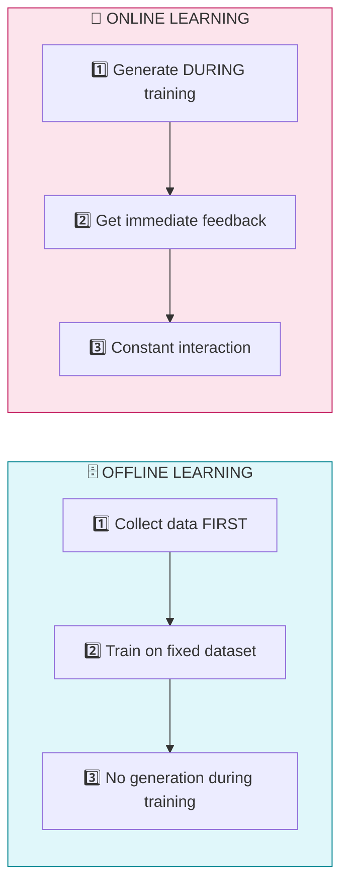
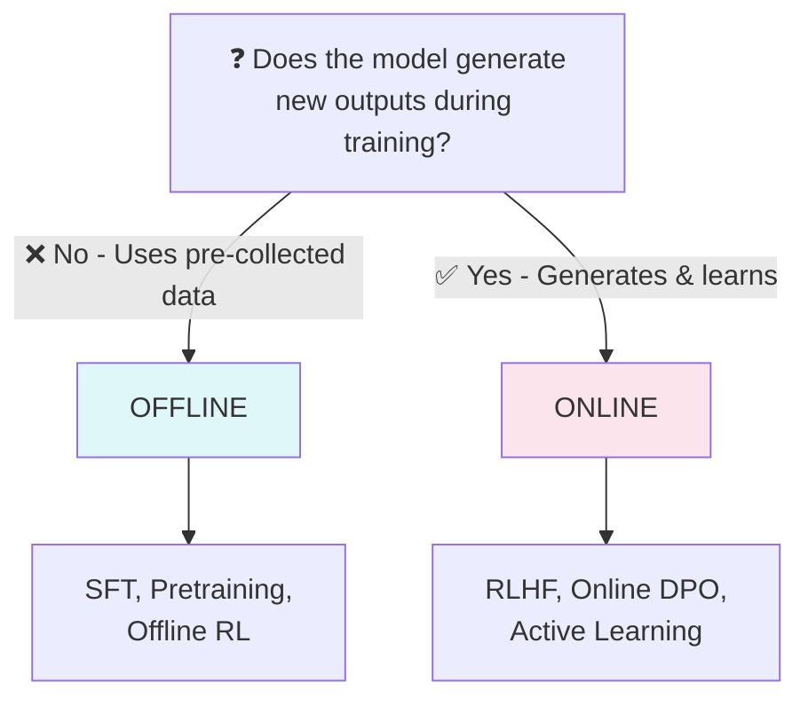
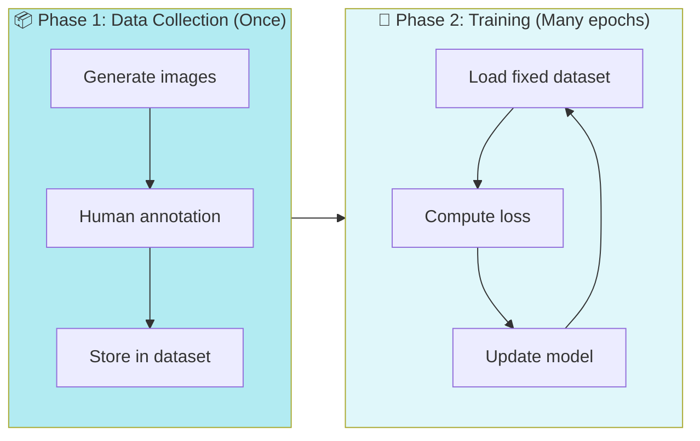
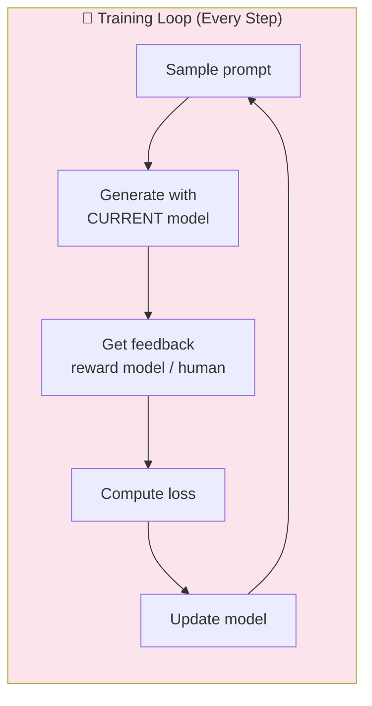
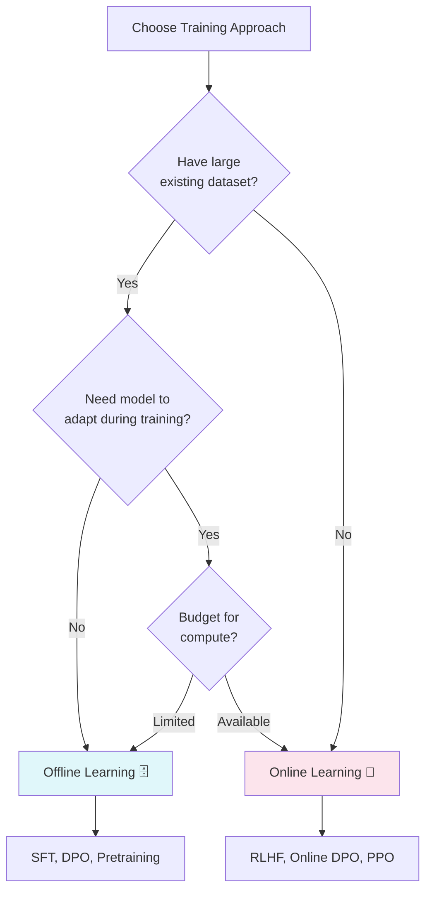

# Online vs Offline Learning

A visual guide to understanding when models generate during training vs learning from fixed datasets.

## TL;DR

| Aspect | Offline Learning | Online Learning |
|--------|------------------|-----------------|
| **Data** | Fixed dataset collected upfront | Generated during training |
| **Interaction** | None during training | Continuous feedback loop |
| **Speed** | ⚡ Fast | 🐢 Slower |
| **Cost** | 💰 Cheaper | 💸 Expensive |
| **Adaptability** | Static | Adapts to improvements |
| **Examples** | SFT, Diffusion pretraining | RLHF, Online DPO |

---

## Flowchart Overview



---

## The Core Difference



---

## Offline Learning

The model learns from a **fixed dataset** collected before training begins.



### Advantages

- ⚡ **Very fast training** — no generation overhead
- ♻️ **Efficient** — reuse same data many times
- 📈 **Scalable** — can leverage massive datasets
- 💰 **Cheaper** — no constant human feedback needed

### Pseudocode

```python
# Step 1: Collect data (once)
dataset = []
for prompt in prompts:
    images = generate_many(prompt)
    best, worst = human_annotate(images)
    dataset.add((prompt, best, worst))

# Step 2: Train on fixed dataset
for epoch in epochs:
    for (prompt, best, worst) in dataset:
        loss = compute_loss(prompt, best, worst)
        update_model(loss)
        # ❌ No new generation happens here!
```

---

## Online Learning

The model **generates new outputs at each training step** and learns from immediate feedback.



### Advantages

- 🎯 **Always on-policy** — training on current model's outputs
- 🔍 **Can explore** — discover new strategies
- 📈 **Better final performance** — potentially
- 🔄 **Adapts** — adjusts to model improvements

### Disadvantages

- 🐢 **Much slower** — constant generation overhead
- 💸 **Expensive** — more GPU compute
- 🖥️ **Resource heavy** — requires more infrastructure

### Pseudocode

```python
for training_step in steps:
    # Step 1: Generate NEW images
    prompt = sample_prompt()
    images = current_model.generate(prompt)
    
    # Step 2: Get feedback
    reward = reward_model(images)
    # or: best, worst = human_feedback(images)
    
    # Step 3: Update model
    loss = compute_loss(prompt, images, reward)
    update_model(loss)
    # ✅ Repeat with updated model!
```

---

## Decision Flowchart



---

## Real-World Examples

| Method | Type | Description |
|--------|------|-------------|
| **SFT** | Offline | Fine-tune on curated prompt-response pairs |
| **DPO** | Offline | Learn from fixed preference dataset |
| **RLHF** | Online | Generate → get reward → update (PPO) |
| **Online DPO** | Online | Generate pairs on-the-fly, update preferences |

---

## Intuitive Analogy

**Offline Learning** = Studying from a textbook
- All examples are pre-written
- You review the same problems multiple times
- Fast, cheap, but can't ask new questions

**Online Learning** = Learning with a tutor
- You attempt problems, get immediate feedback
- Tutor adapts to your current skill level
- Slower, expensive, but more personalized

---
