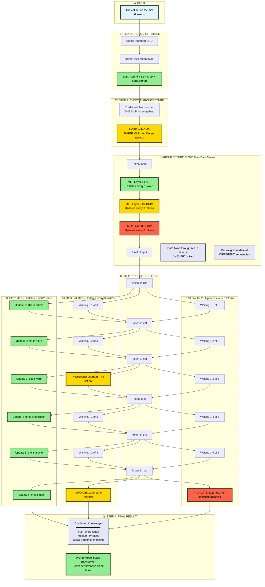

# Nested Learning: The Illusion of Deep Learning Architectures

**Paper by Google Research (NeurIPS 2025)**  

---

## 🎯 TL;DR

This paper reveals that **all of deep learning is actually nested optimization problems** - not just "stacking layers." Every component (optimizers, attention, MLPs) is an **associative memory** that compresses information at different update frequencies.

**The big idea:** Instead of just making models *deeper* (more layers), we should make them have more *levels* (different update frequencies) - like how the human brain processes information at multiple timescales.

**The result:** HOPE - a new architecture that outperforms Transformers by combining:
1. **Continuum Memory System (CMS)** - Multiple MLPs updating at different frequencies
2. **Self-Modifying Updates** - Model learns its own optimization algorithm  
3. **Better Optimizers** - Deep momentum with preconditioning and L2 objectives

---

    
## 🧠 The Core Insight

### Traditional View
```
Deep Learning = Stack more layers
Model depth ≈ Model power
```

### Nested Learning View
```
Deep Learning = Nested optimization problems
Each component = Associative memory compressing context
Order components by UPDATE FREQUENCY, not just depth
```

**Key Discovery:** Gradient descent, momentum, attention - they're all the **same thing** at different levels!

---

## 📊 What This Means

### Current Deep Learning Problems:
1. ❌ Adding layers ≠ automatically better computation
2. ❌ Parameters show marginal improvements with scale
3. ❌ Training converges to suboptimal solutions (optimizer gets stuck)
4. ❌ Limited adaptation - models frozen after pre-training

### Nested Learning Solutions:

| Problem | Traditional Fix | Nested Learning Fix |
|---------|----------------|-------------------|
| Layers don't help | Add more layers | **More levels** (different frequencies) |
| Marginal gains | Bigger models | **Smarter components** (deep optimizers) |
| Suboptimal training | Tune hyperparameters | **Self-modifying** updates |
| No adaptation | Fine-tuning | **Continual consolidation** (multi-timescale) |

---

## 🔑 Three Main Contributions

### 1. Deep Optimizers
**Discovery:** SGD, Adam, momentum are actually **memory modules** that compress gradients

**Improvements:**
- Add **preconditioning** (P_i) - makes momentum distinguish different gradients
- Use **L2 objectives** (delta-rule) - better capacity management
- Use **MLP for momentum** (DMGD) - capture non-linear patterns
- Add **output transform** (Newton-Schulz) → creates Muon optimizer
- **L2 backprop** - handles sequential data dependencies

**Impact:** Optimizers that learn complex gradient patterns instead of blind accumulation

### 2. Self-Modifying Titans
**What:** Model that **learns its own update algorithm**

**How:**
```python
# Traditional
W_new = W_old - learning_rate * gradient

# Self-Modifying  
W_new = W_old - UpdateModule(gradient, context, history)
                    ↑
               Neural network that adapts!
```

**Impact:** Updates adapt based on what's being learned (meta-learning)

### 3. Continuum Memory System (CMS)
**Problem:** LLMs have binary memory (short-term attention / long-term MLP)

**Solution:** **Continuum** of update frequencies

```
Traditional Transformer:
Input → [Attention] → [MLP] → Output
                        ↑
                    Updates once per batch

CMS (HOPE):
Input → [MLP₁] → [MLP₂] → [MLP₃] → ... → Output
         ↑        ↑        ↑
      Every    Every    Every
      token   5 tokens  20 tokens
      (fast)  (medium)   (slow)
```

**Impact:** Different levels specialize in different timescales
- Fast → token patterns
- Medium → phrase patterns  
- Slow → semantic patterns

---

## 🏆 HOPE Architecture

**HOPE = CMS + Self-Modifying + L2 Backprop**

### Why It's Better

**Transformer Problem:**
```
Context: "Alice is CEO of TechCorp"
→ Attention: Processes ✓
→ MLP: Frozen ✗
→ Info lost after context window

Result: Can't learn new facts after pre-training
```

**HOPE Solution:**
```
Context: "Alice is CEO of TechCorp"
→ MLP(f₁): Learns "CEO" + "TechCorp" co-occur
→ MLP(f₂): Learns "Alice-CEO-TechCorp" relation
→ MLP(f₃): Stores semantic fact

Result: Multi-timescale consolidation → long-term memory!
```

### Performance
- ✅ **Language Modeling:** 36.5% better perplexity than Transformers
- ✅ **Reasoning:** +4.98 points on common-sense tasks
- ✅ **Long Context:** Maintains performance where Transformers degrade
- ✅ **Continual Learning:** No catastrophic forgetting

**Beats:** Transformers, RetNet, DeltaNet, Samba, Titans

---

## 🎓 The Unified Framework

Everything in deep learning fits the same pattern:

| Method | What It Really Is |
|--------|------------------|
| **Gradient Descent** | 1-level memory: maps input x → error signal |
| **GD + Momentum** | 2-level: (1) m stores gradients, (2) W updates |
| **Adam** | 2-level: optimal gradient memory |
| **Linear Attention** | 2-level: (1) M stores key→value, (2) W learns projections |
| **Transformer** | CMS with k=1 (single frequency) |
| **HOPE** | CMS with k>1 (multi-frequency) |

**Central equation that unifies everything:**
```
M* = arg min L̃(M(K); V)
     M

Associative memory M maps keys K to values V
```

---

## 💡 Key Takeaways

1. **Everything is memory** - All components compress context at different rates
2. **Levels > Depth** - More optimization levels (frequencies) > more layers
3. **Frequency hierarchy** - Different timescales need different update rates
4. **Meta-learning works** - Learning the update algorithm improves adaptation
5. **Consolidation is key** - Context must flow to long-term memory

---

## 🚀 Why This Matters

### For AI Research:
- New dimension beyond scaling: **More levels, not just more parameters**
- Framework to analyze ANY architecture as nested optimization
- Path to continual learning without catastrophic forgetting

### For Practitioners:
- Better optimizers: Deep momentum, preconditioning, L2 objectives
- Better architectures: Multi-frequency updates (CMS)
- Continual learning: Models that learn over time

### For the Future:
Models that truly **learn continuously** - consolidating information from context into long-term knowledge like the human brain.

---

## 📖 Full Breakdown

**Want the complete deep dive?** Check out the comprehensive Simplify_AI breakdown:

👉 **[View Full HTML Breakdown](https://claude.ai/public/artifacts/9936e32f-9b68-4955-a258-5c4fc18615f1)** 👈

Includes:
- Step-by-step equation breakdowns with examples
- Detailed explanations of all 5 optimizer extensions
- Complete CMS walkthrough with 20-token example
- Mathematical derivations
- Visual diagrams and comparisons
- Practical implications

---

## 📚 Paper Citation

```bibtex
@inproceedings{behrouz2025nested,
  title={Nested Learning: The Illusion of Deep Learning Architectures},
  author={Behrouz, Ali and Razaviyayn, Meisam and Zhong, Peiling and Mirrokni, Vahab},
  booktitle={39th Conference on Neural Information Processing Systems (NeurIPS 2025)},
  year={2025},
  organization={Google Research}
}
```

---

## 🌟 One-Sentence Summary

**Training neural networks is a hierarchy of nested optimization problems where each component is an associative memory compressing context at different frequencies - and adding more *levels* (update frequencies) matters more than just adding more *depth* (layers).**

---

**Created by Simplifiy_AI** - Making Research Accessible  
**Date:** November 2025
